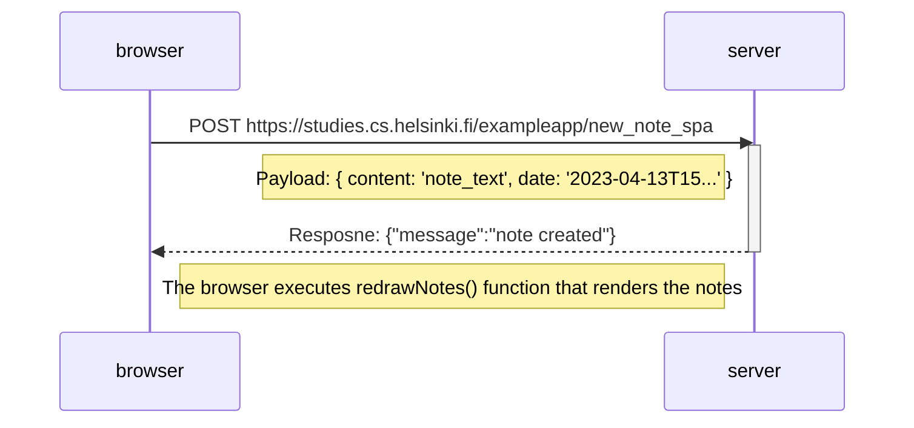

## CPA. Create New Note async action

```mermaid
sequenceDiagram
    participant browser
    participant server

    browser->>server: POST https://studies.cs.helsinki.fi/exampleapp/new_note_spa
    activate server
    Note left of server: Payload: { content: 'note_text', date: '2023-04-13T15...' }
    server-->>browser: Resposne: {"message":"note created"}
    deactivate server

    Note right of browser: The browser executes redrawNotes() function that renders the notes

```